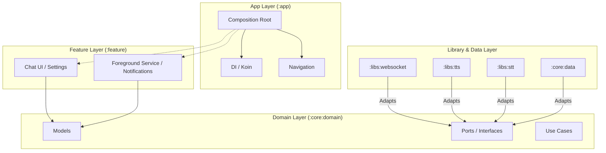

# 🦀 ClawAPK

[](https://kotlinlang.org/)
[](https://www.android.com/)
[](https://opensource.org/licenses/MIT)

**ClawAPK** is the official Android companion app for [OpenClaw](https://github.com/openclaw/openclaw) — an AI agent gateway. Interact with your AI assistant via voice or text, and receive spoken responses, push notifications, and scheduled alerts directly on your phone.

---

## 🚀 Features

- 💬 **Voice & Text Chat** — Seamless communication with OpenClaw via a modern Material 3 chat UI.
- 🔊 **Text-to-Speech (TTS)** — Responses read aloud using [Piper](https://github.com/rhasspy/piper) (Polish) or [Kokoro](https://github.com/remsky/kokoro-fastapi) (English).
- 🎙️ **Speech-to-Text (STT)** — Built-in Android speech recognition for natural voice input.
- ⏰ **Cron Event Listener** — Persistent WebSocket connection for real-time reactions to OpenClaw events:
  - 🔔 **Push Notifications**
  - 🗣️ **Spoken announcements**
  - 📳 **Custom vibration patterns**
- 🌍 **Localization** — Full support for Polish and English, auto-adapting to your device settings.
- 🔐 **Flexible Auth** — Supports tokens, passwords, device pairing, or no-auth modes.
- ⚙️ **Configurable Server** — Connect to any OpenClaw instance (LAN or Cloud).

---

## 🏗️ Architecture

The project follows the **Hexagonal (Ports & Adapters)** architecture, ensuring a clean separation of concerns and testability.

### Architecture Overview



### Module Dependencies

- **`:core:domain`** & **`:core:common`**: Pure Kotlin (no Android dependencies).
- **Adapters**: `:libs:websocket`, `:libs:tts`, `:libs:stt`, `:core:data`.
- **Features**: `:feature:chat`, `:feature:notifications`.
- **App**: Orchestrates everything, wiring adapters to ports via Koin.

---

## 🛠️ Tech Stack

| Layer | Technology |
| :--- | :--- |
| **Language** | Kotlin 2.0 |
| **UI Framework** | Jetpack Compose + Material 3 |
| **Networking** | OkHttp 4 (WebSocket) |
| **Serialization** | kotlinx.serialization |
| **Dependency Injection** | Koin 4 |
| **Audio Engine** | Media3 ExoPlayer |
| **Persistence** | DataStore Preferences |
| **Min SDK** | 29 (Android 10) |

---

## 🏁 Getting Started

### Prerequisites

- ✅ Android Studio Ladybug or newer
- ✅ JDK 11+
- ✅ Running [OpenClaw](https://github.com/openclaw/openclaw) instance

### Build & Install

```bash
git clone https://github.com/your-org/clawapk.git
cd clawapk
./gradlew assembleDebug
adb install app/build/outputs/apk/debug/app-debug.apk
```

### ⚙️ Configuration

1. Launch **ClawAPK**.
2. Tap the **Settings** ⚙️ icon.
3. Enter your OpenClaw server (e.g., `wss://claw.example.com`).
4. Select **Auth Mode**: `None`, `Token`, `Password`, or `Device Pairing`.
5. Choose **TTS Engine** (Polish/Piper or English/Kokoro).
6. Tap **Save and Connect**.

> [!TIP]
> Use **Device Pairing** for the most secure and easiest setup without typing long tokens!

---

## 🔌 OpenClaw Integration

### Cron Events (JSON Payload)

Configure cron jobs on the OpenClaw side to trigger device actions:

```json
{
  "jobId": "morning-reminder",
  "jobName": "Morning Briefing",
  "message": "Good morning! You have 3 meetings today.",
  "actions": ["notify", "speak", "vibrate"]
}
```

| Action | Result |
| :--- | :--- |
| `notify` | 🔔 Show a push notification |
| `speak` | 🗣️ Read message via TTS |
| `vibrate` | 📳 Trigger vibration |
| `sound` | 🔊 Play notification sound |

---

## 📂 Project Structure

- 🧩 **`app/`** — DI, navigation, and entry point.
- 🏛️ **`core/domain/`** — Business logic, ports, and models.
- 💾 **`core/data/`** — Android-specific data adapters (DataStore, Vibration).
- 🔌 **`libs/`** — External integrations (WebSocket, TTS, STT).
- 📱 **`feature/`** — UI modules (Chat, Notifications).

---

## 🛡️ Permissions

| Permission | Purpose |
|-----------|---------|
| `INTERNET` | WebSocket connection to OpenClaw |
| `RECORD_AUDIO` | Speech-to-text input |
| `VIBRATE` | Cron event vibration alerts |
| `POST_NOTIFICATIONS` | Push notifications (Android 13+) |
| `FOREGROUND_SERVICE` | Persistent cron event listener |

## License

This project is licensed under the MIT License.
